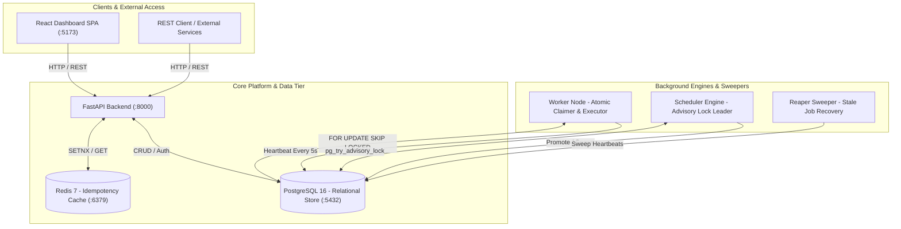

# Codity — Enterprise Distributed Job Scheduler Platform

A production-grade, distributed background job scheduling and execution platform built with **Python 3.11 (FastAPI)**, **PostgreSQL 16**, **Redis 7**, and a modern **React 18 + Vite** dashboard.

Engineered for ultra-high reliability, multi-tenant isolation, sub-millisecond concurrency control, and zero-data-loss fault tolerance.

---

## 🚀 Live AWS Cloud Deployment (Region: `ap-south-1` Mumbai)

Codity is fully deployed and running live on AWS in Mumbai:

- 🖥️ **Web Dashboard (Frontend UI)**: [http://3.7.73.152](http://3.7.73.152)
- ⚙️ **API Control Plane (Backend)**: [http://3.7.73.152:8000](http://3.7.73.152:8000)
- 💚 **Live Health Readiness Probe**: [http://3.7.73.152:8000/health/ready](http://3.7.73.152:8000/health/ready)
- 📚 **Swagger API Docs**: [http://3.7.73.152:8000/docs](http://3.7.73.152:8000/docs)
- 📦 **Container Registry (AWS ECR)**: `206690614418.dkr.ecr.ap-south-1.amazonaws.com`

---

## 📚 Complete Project Documentation Map

Access all deep-dive architecture specs, database schemas, design decisions, and deployment manuals directly below without needing to browse files in `docs/`:

| Document Topic | File Location | Description & Contents |
| :--- | :--- | :--- |
| 🏛️ **Architecture & State Machine** | [`docs/ARCHITECTURE.md`](docs/ARCHITECTURE.md) | C4 Component Diagrams, `FOR UPDATE SKIP LOCKED` claim logic, Single-Leader Advisory Lock Scheduler, Reaper Sweeper. |
| ☁️ **AWS Production Deployment** | [`docs/AWS_DEPLOYMENT_GUIDE.md`](docs/AWS_DEPLOYMENT_GUIDE.md) | AWS ECR URIs, EC2 `t3.small` server configuration, Security Groups, `user-data.sh` script, SSH access, verification. |
| 🗄️ **Database Schema & ERD** | [`docs/DATABASE_SCHEMA.md`](docs/DATABASE_SCHEMA.md) | Complete Relational ER Diagram, Indexing strategies, FK Cascading rules, table schema specifications. |
| 💡 **Design Decisions & Trade-offs** | [`docs/DESIGN_DECISIONS.md`](docs/DESIGN_DECISIONS.md) | Technical rationale: Postgres `SKIP LOCKED` vs RabbitMQ/Celery, Redis `SETNX` idempotency, jittered exponential backoffs. |
| ☁️ **Universal Cloud Hosting** | [`docs/CLOUD_DEPLOYMENT.md`](docs/CLOUD_DEPLOYMENT.md) | Step-by-step guides for AWS ECS/EKS, GCP Cloud Run, Azure, DigitalOcean, Kubernetes, Railway, Render, Fly.io. |
| 📈 **Milestones & Progress Log** | [`docs/PROGRESS.md`](docs/PROGRESS.md) | Feature implementation log, 37 test suite validation history, completed system milestones. |
| 📋 **Assignment Briefs & Specs** | [`docs/specs/`](docs/specs/) | Original specification documents including `task.txt` and problem statement PDFs. |

---

## Key Features

* **Multi-Tenant Security & Isolation**: Strict project and organization scoping with JWT authentication (Bcrypt rounds=12) and Role-Based Access Control (`ADMIN` / `MEMBER`).
* **Atomic Concurrency Control**: High-throughput distributed queue consumption using PostgreSQL `SELECT ... FOR UPDATE SKIP LOCKED` without lock contention or race conditions.
* **24-Hour Redis Idempotency Cache**: `O(1)` duplicate request elimination via Redis `SETNX` with 24-hour TTL and seamless PostgreSQL fallback.
* **Flexible Scheduling Engine**: Single-leader elected scheduler via PostgreSQL Advisory Locks (`pg_try_advisory_lock`) handling both delayed execution and recurring standard 5-field cron templates (`croniter`).
* **Resilient Retry Backoff**: Configurable per-queue retry policies: `Fixed`, `Linear`, and `Exponential with Full Jitter`.
* **Dead Letter Queue (DLQ) & Single-Click Replay**: Automatically sequesters exhausted jobs into DLQ with reason payloads and instant manual re-dispatching.
* **Stale Worker & Orphaned Job Reaper**: Autonomous sweeper detecting dead nodes (expired heartbeats > 15s) and immediately recovering in-flight jobs back to `queued`.
* **Live Telemetry & React Dashboard**: Real-time KPI cards, 24-hour execution throughput charts, worker cluster node monitoring, and interactive job explorers.
* **Cloud-Native & Kubernetes Ready**: Complete production Docker Compose manifests (`docker-compose.prod.yml`) and Kubernetes specs (`k8s/codity-all-in-one.yaml`).

---

## System Architecture



---

## Quick Start (Docker Compose)

The fastest way to spin up the entire cluster locally:

```bash
# 1. Clone repository
git clone https://github.com/Ayush-AM/codity.git
cd codity

# 2. Build and launch all microservices in detached mode
docker compose up --build -d

# 3. Stream backend logs
docker compose logs -f api
```

### Access URLs (Local):
* **Frontend Dashboard:** [http://localhost:5173](http://localhost:5173) (Default Admin: `admin@example.com` / `StrongP@ss123`)
* **Interactive Swagger Docs:** [http://localhost:8000/docs](http://localhost:8000/docs)
* **ReDoc Documentation:** [http://localhost:8000/redoc](http://localhost:8000/redoc)
* **PgAdmin Web Management:** [http://localhost:5050](http://localhost:5050)
* **Health Check:** `curl http://localhost:8000/health/ready`

---

## Scaling Worker Nodes

To scale background workers horizontally across the cluster:

```bash
# Scale to 4 parallel worker instances
docker compose up -d --scale worker=4
```

---

## Running Automated Tests

Run the comprehensive 37-test automated test suite (Auth, Concurrency, Jobs, Workers, Retries, Reaper, DLQ, Telemetry):

```bash
pytest
```

Output:
```text
============================== 37 passed in 6.76s ==============================
```

### Automated Test Cases Breakdown (37 / 37 Passing)

| Category | Test Case Function | Description & Verification |
| :--- | :--- | :--- |
| **Authentication & Multi-Tenancy** | `test_register_new_tenant` | Verifies atomic creation of organization, root admin, default project, and default queue. |
| | `test_login_success` | Verifies JWT token generation and Bcrypt password verification (rounds=12). |
| | `test_login_invalid_password` | Verifies `401 Unauthorized` response on invalid password. |
| | `test_protected_route_with_and_without_token` | Verifies tenant isolation and Bearer token enforcement on protected routes. |
| **Atomic Concurrency & Worker Claiming** | `test_concurrent_atomic_claims` | Simulates 10 parallel worker threads claiming jobs; verifies 0 duplicate claims via `FOR UPDATE SKIP LOCKED`. |
| | `test_atomic_claim_jobs` | Verifies transition of queued jobs to `claimed` status with assigned worker IDs. |
| | `test_worker_heartbeat_lifecycle` | Verifies worker node registration, 5-second heartbeats, and graceful deregistration. |
| | `test_postgresql_advisory_locks` | Verifies single-leader scheduler election via `pg_try_advisory_lock`. |
| **Job Scheduling & Cron Evaluation** | `test_submit_immediate_job` | Verifies immediate job creation, payload storage, and initial `queued` state. |
| | `test_create_delayed_job` | Verifies delayed jobs start in `scheduled` status with future `scheduled_at` timestamps. |
| | `test_scheduler_promotes_delayed_jobs` | Verifies leader scheduler automatically promotes due delayed jobs to `queued`. |
| | `test_submit_cron_job` | Verifies standard 5-field cron expression parsing (e.g. `*/5 * * * *`) and recurring template creation. |
| | `test_scheduler_evaluates_cron_templates` | Verifies leader scheduler evaluates active cron templates and spawns executable child jobs. |
| **Retry Engine & Backoff Math** | `test_fixed_retry_delay` | Verifies fixed retry delay calculation (`T = base_delay`). |
| | `test_linear_retry_delay` | Verifies linear retry delay calculation (`T = base_delay * attempt`). |
| | `test_exponential_retry_delay_with_cap` | Verifies exponential retry delay (`T = base_delay * 2^attempt`) capped at maximum duration. |
| | `test_exponential_retry_delay_with_jitter` | Verifies full jitter randomization to prevent thundering herd API retries. |
| | `test_calculate_retry_delay_fixed` | Unit test for fixed policy calculation. |
| | `test_calculate_retry_delay_linear` | Unit test for linear policy calculation. |
| | `test_calculate_retry_delay_exponential` | Unit test for exponential policy calculation. |
| | `test_calculate_retry_delay_maxed` | Verifies behavior when `retry_count` reaches `max_retries`. |
| **Dead Letter Queue & Replay** | `test_move_exhausted_job_to_dlq_and_replay` | Verifies jobs exceeding `max_retries` transition to `dead` and move to DLQ. |
| | `test_dlq_manual_retry` | Verifies single-click DLQ replay endpoint re-queuing dead jobs back to active queues. |
| | `test_job_failure_and_retry` | Verifies end-to-end execution failure logging and attempt incrementing. |
| **Self-Healing Reaper & Crash Recovery** | `test_reaper_sweeps_dead_workers_and_recovers_jobs` | Simulates crashed worker node (> 15s heartbeat); verifies Reaper marks node `dead` & re-queues in-flight jobs. |
| | `test_reaper_recovery` | Integration test verifying zero job loss during worker container crashes. |
| | `test_job_executions_and_logs_queries` | Verifies audit log insertion (`job_logs`) and execution history tracking (`job_executions`). |
| **Job Explorer & Idempotency** | `test_create_immediate_job` | Integration test for end-to-end job submission endpoint. |
| | `test_job_lifecycle` | Tests complete state flow: `QUEUED` → `CLAIMED` → `RUNNING` → `COMPLETED`. |
| | `test_job_submission_idempotency` | Tests Redis `Idempotency-Key` deduplication, blocking duplicate submissions within 24h. |
| | `test_job_explorer_filtering` | Verifies paginated job search by status, queue, and text query. |
| | `test_create_and_manage_queues` | Verifies queue creation, priority, concurrency limits, and pause/resume toggles. |
| | `test_register_login` | Integration test for tenant signup and authentication flow. |
| **Telemetry & Health Probes** | `test_cron_parsing` | Verifies `croniter` expression parsing and next execution time calculation. |
| | `test_health_endpoints` | Tests `/health/ready` deep database and Redis Liveness/Readiness probes. |
| | `test_queue_and_system_metrics` | Verifies aggregate KPI calculation (active queues, throughput, 24h failure rate). |
| | `test_protected_route_with_and_without_token` | Verification of multi-tenant security boundaries. |

---

## API Reference Highlights

| Method | Endpoint | Description |
| :--- | :--- | :--- |
| `POST` | `/api/v1/auth/register` | Register new organization & root admin |
| `POST` | `/api/v1/auth/login` | Authenticate and obtain JWT bearer token |
| `GET`  | `/api/v1/auth/oauth/url/{provider}` | Retrieve OAuth 2.0 authorization redirect URL (Google / GitHub) |
| `POST` | `/api/v1/auth/oauth/login` | Authenticate or auto-register user via OAuth 2.0 token/code |
| `POST` | `/api/v1/projects/{id}/queues` | Create isolated queue partition |
| `POST` | `/api/v1/queues/{id}/jobs` | Submit immediate, delayed, or cron job (supports `Idempotency-Key`) |
| `GET`  | `/api/v1/jobs/` | Explorer with multi-tenant filtering and text search |
| `GET`  | `/api/v1/workers/` | Node cluster heartbeats and active load |
| `DELETE`| `/api/v1/workers/{id}` | Decommission worker node |
| `GET`  | `/api/v1/dlq/` | List dead letter queue entries |
| `POST` | `/api/v1/dlq/{id}/retry` | Single-click replay dead job into active queue |
| `GET`  | `/health/ready` | Deep database and Redis connectivity probe |

---

## Repository Layout

```text
.
├── app/                        # FastAPI Backend & Async Workers
│   ├── api/v1/endpoints/       # Auth, Queues, Jobs, Workers, DLQ, Metrics, Health
│   ├── core/                   # Config, DB connection, JWT Security, Shutdown
│   ├── models/                 # SQLAlchemy 2.0 ORM Declarations
│   ├── schemas/                # Pydantic V2 Request/Response Validation
│   ├── services/               # Claimer, Executor, Retry, DLQ, Scheduler, Reaper, Metrics
│   ├── utils/                  # Helpers & utilities
│   ├── workers/                # Main Worker, Scheduler Leader, Reaper Sweeper
│   └── main.py                 # FastAPI Application Entrypoint
├── alembic/                    # Database Version Migrations
├── frontend/                   # React 18 + Vite + MUI + React Query Dashboard
├── k8s/                        # Kubernetes Production Manifests (codity-all-in-one.yaml)
├── docs/                       # Project Documentation & Architecture
│   ├── specs/                  # Original Assignment task.txt & PDF Specs
│   ├── ARCHITECTURE.md         # C4 Diagrams & Architectural Specs
│   ├── AWS_DEPLOYMENT_GUIDE.md # AWS ECR + EC2 Production Deployment Guide
│   ├── CLOUD_DEPLOYMENT.md     # Universal Cloud Hosting Manual
│   ├── DATABASE_SCHEMA.md      # Relational Schema & Indexing Models
│   ├── DESIGN_DECISIONS.md     # Technical Trade-offs & Analysis
│   └── PROGRESS.md             # Milestone Tracking
├── tests/                      # Full Pytest Test Suite (37 Tests)
├── docker-compose.yml          # Multi-container orchestration
├── docker-compose.prod.yml     # Production compose spec
├── Dockerfile                  # Multi-stage Python 3.11 build
├── requirements.txt            # Python Dependencies
├── pytest.ini                  # Pytest Configuration
└── pyrightconfig.json          # Workspace Typechecking Configuration
```
