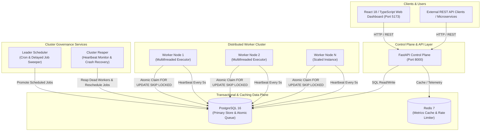
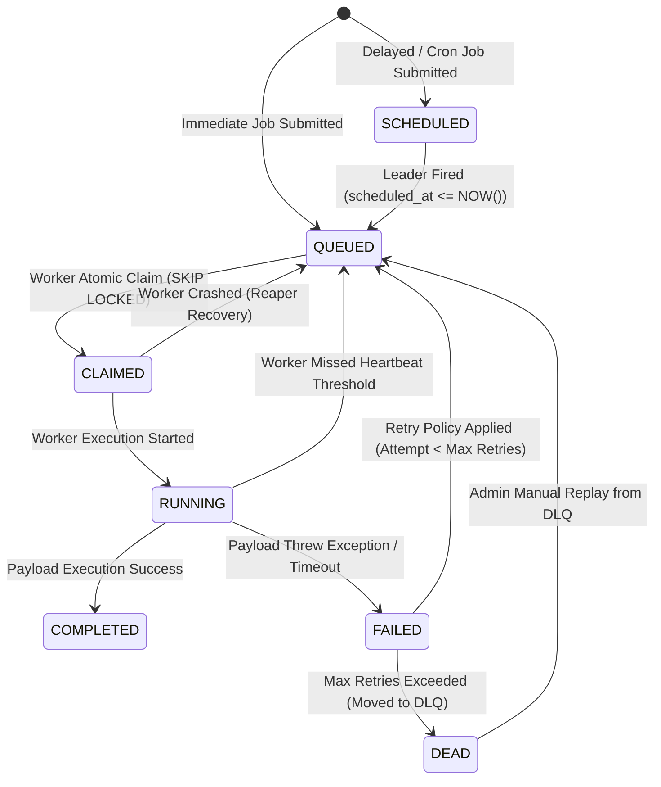

# 🏛️ Codity — Enterprise Distributed Job Scheduling Platform Architecture

## 1. Executive Summary & Core Philosophy

**Codity** is a production-ready, highly available, multi-tenant distributed job scheduling and background processing platform. It is engineered to reliably route, execute, schedule, monitor, and retry background workloads at massive scale with zero job loss.

### Design Principles
1. **Pull-Based Worker Model**: Eliminates message broker consumer bottlenecks by utilizing PostgreSQL row-level locks (`SELECT ... FOR UPDATE SKIP LOCKED`) for contention-free atomic task claiming.
2. **Zero Third-Party Message Queue Overhead**: Eliminates external queue broker dependencies (like RabbitMQ or Celery) by maintaining the entire job state machine transactionally inside PostgreSQL.
3. **Self-Healing Cluster Architecture**: Features automated leader election, stale worker reaping, intelligent exponential retry backoffs, and Dead Letter Queue (DLQ) isolation.
4. **Strict Multi-Tenancy**: Scopes all operations hierarchically under `Organizations` $\rightarrow$ `Projects` $\rightarrow$ `Queues` $\rightarrow$ `Jobs`.

---

## 2. High-Level System Architecture



---

## 3. Microservice Components & Cluster Roles

The Codity platform runs as 8 decoupled services orchestrated seamlessly via Docker Compose:

| Container Name | Technology | Role & Responsibility |
| :--- | :--- | :--- |
| **`scheduler_frontend`** | Nginx / React 18 / MUI | Serves the web dashboard for visual queue control, live job telemetry, and DLQ management on port `5173`. |
| **`scheduler_api`** | Python 3.11 / FastAPI | REST Control Plane handling authentication, tenant isolation, queue configuration, and job submission on port `8000`. |
| **`scheduler_postgres`** | PostgreSQL 16 (Alpine) | ACID relational state store holding queue partitions, job logs, execution history, and row locks for atomic task dispatch. |
| **`scheduler_redis`** | Redis 7 (Alpine) | High-speed cache storing realtime throughput metrics and API rate-limiting tokens on port `6379`. |
| **`scheduler_worker`** | Python / ThreadPool | Ephemeral worker nodes polling queued tasks via `FOR UPDATE SKIP LOCKED`, executing payloads, and streaming heartbeats. |
| **`scheduler_leader`** | Python / Croniter | Centralized leader process sweeping scheduled/cron jobs and spawning executable child instances into active queues. |
| **`scheduler_reaper`** | Python / Heartbeat Monitor | Cluster liveness monitor detecting crashed worker processes, marking them `dead`, and safely re-enqueuing abandoned tasks. |
| **`scheduler_pgadmin`** | PgAdmin 4 | Web-based database management interface on port `5050` (optional administration GUI). |

---

## 4. Job State Machine & Lifecycle

Every job submitted to Codity moves through a strictly validated, state machine:



### State Definitions
* **`QUEUED`**: Eligible for immediate claiming by active worker processes.
* **`SCHEDULED`**: Held for future execution (cron trigger or delayed timestamp `scheduled_at`).
* **`CLAIMED`**: Atomically locked by a specific worker node (`worker_id`).
* **`RUNNING`**: Active execution in progress on a worker thread.
* **`COMPLETED`**: Execution finished with return code `0` / clean status.
* **`FAILED`**: Execution failed; backoff delay calculated before re-enqueueing.
* **`DEAD`**: Permanent failure. Retries exhausted; stored in Dead Letter Queue for inspection/replay.

---

## 5. Deep-Dive Mechanisms

### 5.1 Atomic Job Claiming Algorithm
To prevent race conditions, double-claiming, and lock contention between multiple worker processes, Codity uses PostgreSQL's native `FOR UPDATE SKIP LOCKED` primitive:

$$\text{Claim Logic} = \text{SELECT job WHERE status = 'queued' AND queue\_id = Q ORDER BY priority ASC, created\_at ASC FOR UPDATE SKIP LOCKED LIMIT 1}$$

```sql
WITH next_job AS (
    SELECT id 
    FROM jobs
    WHERE queue_id = :queue_id 
      AND status = 'queued'
    ORDER BY priority ASC, created_at ASC
    FOR UPDATE SKIP LOCKED
    LIMIT 1
)
UPDATE jobs
SET status = 'claimed',
    worker_id = :worker_id,
    updated_at = NOW()
FROM next_job
WHERE jobs.id = next_job.id
RETURNING jobs.*;
```
* **Queue Concurrency Limits**: Before claiming a job from queue $Q$, the system verifies that current active claimed/running jobs for $Q$ do not exceed $Q.\text{concurrency\_limit}$.

### 5.2 Retry Policy & Backoff Math
When a job fails, the system calculates the delay before the job becomes eligible for retry based on the Queue's configured strategy:

1. **Fixed Delay**:
   $$T_{\text{delay}} = \text{base\_delay}$$

2. **Linear Backoff**:
   $$T_{\text{delay}} = \text{base\_delay} \times \text{retry\_count}$$

3. **Exponential Backoff**:
   $$T_{\text{delay}} = \text{base\_delay} \times 2^{\text{retry\_count}}$$

$$\text{New Scheduled Timestamp} = \text{NOW}() + T_{\text{delay}}$$

### 5.3 Cluster Fault Tolerance & Reaper Recovery
* **Heartbeat Mechanism**: Every worker process sends an heartbeat ping every 5 seconds updating its record in the `workers` table:
  $$\text{UPDATE workers SET last\_heartbeat = NOW() WHERE id = :worker\_id}$$
* **Reaper Sweeper**: The Reaper service sweeps the `workers` table every 10 seconds:
  $$\text{Dead Condition} = \text{last\_heartbeat} < \text{NOW}() - \text{INTERVAL } '30\text{ seconds}'$$
* **Orphan Job Rescheduling**: Any jobs stuck in `claimed` or `running` assigned to a `dead` worker are automatically reset to `queued` with their retry counters updated, ensuring zero lost tasks.

---

## 6. Project Directory Structure

```
codity/
├── app/                        # FastAPI Backend & Async Workers
│   ├── api/                    # REST Endpoint Handlers
│   │   └── v1/
│   │       └── endpoints/      # auth, jobs, queues, workers, dlq, metrics
│   ├── core/                   # Security, Config, Database Engine
│   ├── db/                     # Alembic Migrations & Models
│   ├── models/                 # SQLAlchemy Data Models
│   ├── schemas/                # Pydantic Request/Response Schemas
│   ├── services/               # Core Business Logic (queue, claim, scheduler)
│   └── workers/                # Cluster Background Processes
│       ├── worker_process.py   # Task Execution Worker
│       ├── leader_process.py   # Cron Sweeper & Scheduler Leader
│       └── reaper_process.py   # Heartbeat Reaper & Recovery
├── docs/                       # Project Documentation & Architecture
├── frontend/                   # React 18 + Vite + MUI Dashboard
│   ├── src/
│   │   ├── api/                # Axios API Clients
│   │   ├── components/         # Reusable UI Cards, Modals, Layout
│   │   ├── pages/              # Dashboard, Jobs, Queues, Workers, DLQ
│   │   └── theme/              # MUI Square Dark Theme Setup
│   ├── Dockerfile              # Multi-stage Frontend Production Build
│   └── package.json
├── docker-compose.yml          # Full 8-Container Orchestration Manifest
├── Dockerfile                  # Python Backend Container Spec
├── requirements.txt            # Python Dependencies
└── README.md                   # Project Overview & Quickstart
```

---

## 7. How to Start & Run the Project

### Method A: Production Setup (Recommended — Docker 1-Command)
Run everything effortlessly in Docker with 1 single command from the project root directory `C:\Ayush\Desktop\codity`:

```bash
# 1. Clone the repository (if not already local)
git clone https://github.com/your-username/codity.git
cd codity

# 2. Build and launch all 8 services in background
docker compose up --build -d
```

#### Access Points
* 🎨 **Frontend Web Dashboard**: [http://localhost:5173](http://localhost:5173)
* ⚡ **Backend REST API Specs (Swagger)**: [http://localhost:8000/docs](http://localhost:8000/docs)
* 🗄️ **PgAdmin Database Manager**: [http://localhost:5050](http://localhost:5050)

#### Scale Worker Compute Nodes
To scale up worker nodes across the cluster on demand:
```bash
docker compose up -d --scale worker=4
```

---

### Method B: Local Developer Setup (No Docker for App Code)

If you wish to run the React frontend and FastAPI backend directly on your local machine for rapid development:

#### Step 1: Start Database & Redis Prerequisites via Docker
```bash
docker compose up -d postgres redis
```

#### Step 2: Set Up Python Backend Virtual Environment
```bash
# Create virtual environment
python -m venv venv

# Activate virtual environment (Windows PowerShell)
.\venv\Scripts\Activate.ps1

# Install backend dependencies
pip install -r requirements.txt

# Run Alembic Database Migrations
alembic upgrade head
```

#### Step 3: Launch Local Services (Separate Terminals)

1. **Start FastAPI Control Plane API**:
   ```bash
   uvicorn app.main:app --reload --port 8000
   ```

2. **Start Background Worker Node**:
   ```bash
   python -m app.workers.worker_process
   ```

3. **Start Leader Cron Sweeper**:
   ```bash
   python -m app.workers.leader_process
   ```

4. **Start Cluster Reaper Service**:
   ```bash
   python -m app.workers.reaper_process
   ```

5. **Start React Frontend (Vite Dev Server)**:
   ```bash
   cd frontend
   npm install
   npm run dev
   ```

Open [http://localhost:5173](http://localhost:5173) in your browser!

---

## 8. Cloud-Native Production & Kubernetes Readiness

Codity is fully compatible with all major cloud platforms and container orchestration platforms.

### Production Resources Created:
1. **Production Compose Spec**: [`docker-compose.prod.yml`](file:///c:/Ayush/Desktop/codity/docker-compose.prod.yml) (includes log rotation, container restart policies, and healthchecks).
2. **Kubernetes Production Manifests**: [`k8s/codity-all-in-one.yaml`](file:///c:/Ayush/Desktop/codity/k8s/codity-all-in-one.yaml) (Namespace, ConfigMaps, Secrets, API, Workers, Leader, Reaper, Frontend LoadBalancer).
3. **Universal Cloud Deployment Manual**: [`docs/CLOUD_DEPLOYMENT.md`](file:///c:/Ayush/Desktop/codity/docs/CLOUD_DEPLOYMENT.md) (step-by-step guides for AWS ECS/EKS, GCP Cloud Run/GKE, Azure Container Apps/AKS, DigitalOcean, Railway, Render, Fly.io).

