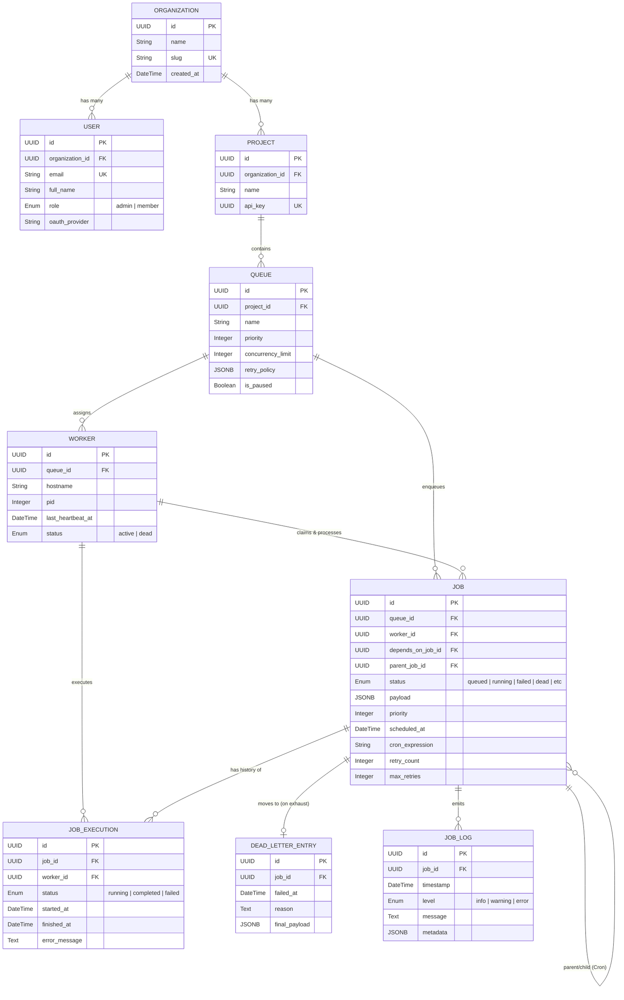
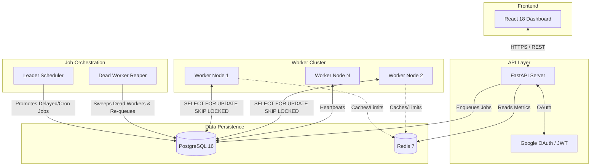

# System Architecture & Database Schema

This document outlines the complete system architecture and relational database schema for Codity. 

## 1. Database Entity-Relationship (ER) Schema

The platform relies on a heavily relational PostgreSQL structure optimized for hierarchical multi-tenancy, high-throughput job queueing, and atomic worker claiming.

## 2. Core Architectural Components & Data Flow

Codity operates as a highly concurrent distributed system. Here is the visual architecture representing the flow of jobs and worker coordination:

### Schema & Architecture Highlights:
- **Atomic Claiming**: Your workers rely on the `jobs` and `workers` table indexes to execute `SELECT ... FOR UPDATE SKIP LOCKED`. This guarantees that in a multi-worker environment, no two workers will ever process the same job at the same time.
- **Self-Healing Design**: The Reaper process specifically scans the `Worker` table for `last_heartbeat_at` anomalies. If a worker crashes or drops off the network, the Reaper automatically strips its jobs and transitions them back to the queue, while marking the worker as `dead`.
- **Data Integrity**: By utilizing strict PostgreSQL Foreign Key constraints (`ON DELETE CASCADE` and `ON DELETE SET NULL`) combined with native Enums (`JobStatus`, `WorkerStatus`), the database mathematically guarantees that you cannot have corrupted state transitions or orphaned data records.
