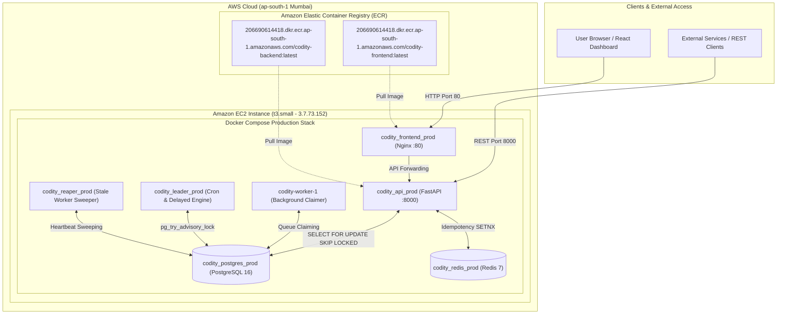

# Codity — AWS Production Deployment Manual

This document provides a comprehensive operational guide for the production deployment of **Codity** on **Amazon Web Services (AWS)** in the **`ap-south-1` (Mumbai)** region.

---

## 🌐 Live Production Deployment Overview

- 🖥️ **Web Dashboard (React SPA)**: [http://3.7.73.152](http://3.7.73.152)
- ⚙️ **API Control Plane (FastAPI)**: [http://3.7.73.152:8000](http://3.7.73.152:8000)
- 💚 **Live Health Check Endpoint**: [http://3.7.73.152:8000/health/ready](http://3.7.73.152:8000/health/ready)
- 📚 **Swagger API Documentation**: [http://3.7.73.152:8000/docs](http://3.7.73.152:8000/docs)
- 📦 **GitHub Repository**: [https://github.com/Ayush-AM/codity](https://github.com/Ayush-AM/codity)

---

## 🏗️ Architecture & Component Topology



---

## 🔑 AWS Infrastructure Specifications

| Parameter | Configuration Value |
| :--- | :--- |
| **AWS Region** | `ap-south-1` (Mumbai, India) |
| **AWS Account ID** | `206690614418` |
| **IAM Deployer User** | `Codity` (`arn:aws:iam::206690614418:user/Codity`) |
| **EC2 Server Instance ID** | `i-040eaed3beb59a46a` |
| **Instance Type** | `t3.small` (2 vCPU, 2GB RAM) |
| **Public IPv4 Address** | `3.7.73.152` |
| **Security Group** | `codity-sg` (`sg-0b0b453e72828dfd4`) |
| **Inbound Security Rules** | Port `22` (SSH), Port `80` (HTTP), Port `8000` (API), Port `443` (HTTPS) |
| **SSH Key Pair** | `codity-key` (`codity-key.pem` saved locally) |

---

## 🔐 Google OAuth 2.0 Configuration

Codity supports single sign-on (SSO) via Google OAuth. To enable this in production, you must set the following environment variables on the EC2 server in a `.env` file located in the root of the cloned repository:

```env
GOOGLE_CLIENT_ID="<your-google-client-id>.apps.googleusercontent.com"
GOOGLE_CLIENT_SECRET="<your-google-client-secret>"
OAUTH_REDIRECT_URI="http://3.7.73.152:8000/api/v1/auth/oauth/callback/google"
CORS_ORIGINS="http://localhost:5173,http://127.0.0.1:5173,http://3.7.73.152,http://3.7.73.152:80"
```

> **Important:** The `OAUTH_REDIRECT_URI` must exactly match the authorized redirect URI configured in your Google Cloud Console.

---

## 📦 Container Registry (AWS ECR URIs)

Both application layers are built into standalone Docker images and stored in AWS ECR:

1. **Backend API & Engine Container**:
   ```text
   206690614418.dkr.ecr.ap-south-1.amazonaws.com/codity-backend:latest
   ```

2. **Frontend Dashboard Container**:
   ```text
   206690614418.dkr.ecr.ap-south-1.amazonaws.com/codity-frontend:latest
   ```

---

## 🛠️ Step-by-Step Deployment Procedure

### 1. Build and Push Container Images to AWS ECR

```powershell
# Authenticate local Docker daemon with AWS ECR in Mumbai
aws ecr get-login-password --region ap-south-1 | docker login --username AWS --password-stdin 206690614418.dkr.ecr.ap-south-1.amazonaws.com

# Build and push Frontend
docker build -t codity-frontend:latest ./frontend
docker tag codity-frontend:latest 206690614418.dkr.ecr.ap-south-1.amazonaws.com/codity-frontend:latest
docker push 206690614418.dkr.ecr.ap-south-1.amazonaws.com/codity-frontend:latest

# Build and push Backend
docker build -t codity-backend:latest .
docker tag codity-backend:latest 206690614418.dkr.ecr.ap-south-1.amazonaws.com/codity-backend:latest
docker push 206690614418.dkr.ecr.ap-south-1.amazonaws.com/codity-backend:latest
```

---

### 2. EC2 Launch Script (`user-data.sh`)

When launching the EC2 instance, the automated user-data script installs dependencies and starts the Docker Compose stack:

```bash
#!/bin/bash
exec > /var/log/user-data.log 2>&1
set -ex

# AWS Region
export AWS_DEFAULT_REGION="ap-south-1"

# Install Docker & Git
dnf update -y
dnf install -y docker git unzip
systemctl enable --now docker
usermod -aG docker ec2-user

# Install Docker Compose Plugin
mkdir -p /usr/libexec/docker/cli-plugins
curl -SL https://github.com/docker/compose/releases/download/v2.24.5/docker-compose-linux-x86_64 -o /usr/libexec/docker/cli-plugins/docker-compose
chmod +x /usr/libexec/docker/cli-plugins/docker-compose

# Clone Repo & Pull Containers
cd /home/ec2-user
git clone https://github.com/Ayush-AM/codity.git
cd codity

# Create Production .env file
cat <<EOF > .env
POSTGRES_USER=codity_user
POSTGRES_PASSWORD=codity_password
POSTGRES_DB=codity_db
SECRET_KEY=supersecretkey_change_in_production
GOOGLE_CLIENT_ID="your_google_client_id_here"
GOOGLE_CLIENT_SECRET="your_google_client_secret_here"
OAUTH_REDIRECT_URI="http://3.7.73.152:8000/api/v1/auth/oauth/callback/google"
CORS_ORIGINS="http://localhost:5173,http://127.0.0.1:5173,http://3.7.73.152,http://3.7.73.152:80"
EOF

# Authenticate Docker & Start Containers
aws ecr get-login-password --region ap-south-1 | docker login --username AWS --password-stdin 206690614418.dkr.ecr.ap-south-1.amazonaws.com
docker compose -f docker-compose.prod.yml pull
docker compose -f docker-compose.prod.yml up -d
```

---

## 🔍 Verification & Health Checking

To verify the live server status from any terminal:

```bash
# Check Frontend status
curl -I http://3.7.73.152

# Check Backend readiness probe
curl http://3.7.73.152:8000/health/ready
```

Expected Output:
```json
{
  "status": "ready",
  "database": "connected",
  "redis": "connected",
  "timestamp": "2026-08-23T09:51:51.407833+00:00"
}
```

---

## 💻 Managing the EC2 Production Server

To SSH into the live server:

```powershell
ssh -i codity-key.pem ec2-user@3.7.73.152
```

Useful management commands on the server:

```bash
# View active container status
sudo docker ps

# Stream logs of all services
sudo docker compose -f /home/ec2-user/codity/docker-compose.prod.yml logs -f

# Restart microservices
sudo docker compose -f /home/ec2-user/codity/docker-compose.prod.yml restart
```
