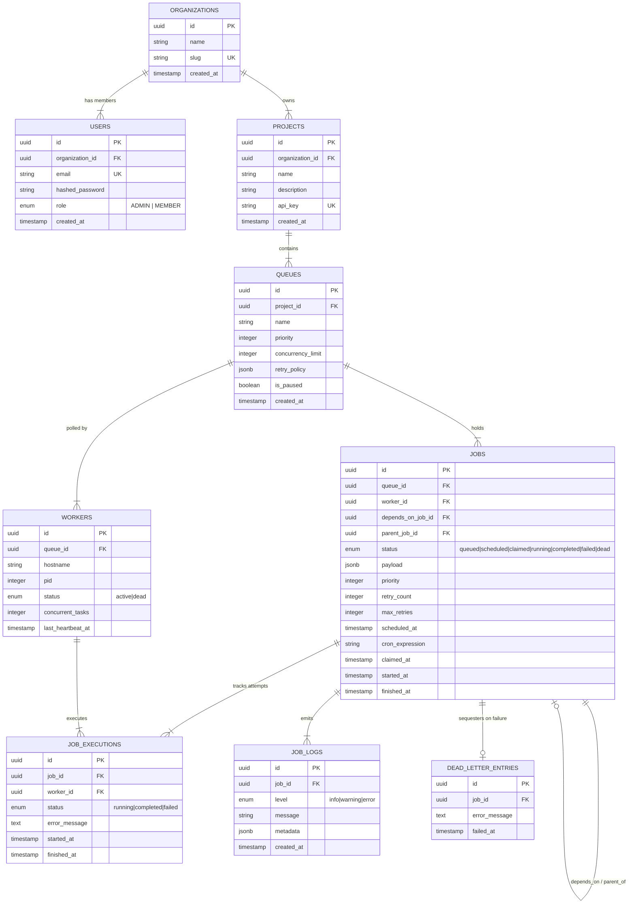

# Database Schema & Entity-Relationship Specification

## 1. Relational Architecture Overview

Codity utilizes PostgreSQL 16 as its authoritative state store. The schema is designed following 3NF relational normalization guidelines while leveraging PostgreSQL `JSONB` data types for flexible job payloads and queue retry policies.

---

## 2. Entity-Relationship (ER) Diagram

---

## 3. Core Tables Specification

### 3.1 `organizations`
Top-level multi-tenancy boundary.
* **`id`** (`UUID`, PK): Unique organization identifier.
* **`name`** (`VARCHAR(255)`): Organization display name.
* **`slug`** (`VARCHAR(255)`, UNIQUE): URL-friendly tenant slug.

### 3.2 `users`
Authenticated users with Role-Based Access Control (RBAC).
* **`id`** (`UUID`, PK): User identifier.
* **`organization_id`** (`UUID`, FK $\rightarrow$ `organizations.id` ON DELETE CASCADE): Tenant reference.
* **`email`** (`VARCHAR(255)`, UNIQUE, INDEX): Login credential.
* **`hashed_password`** (`VARCHAR(255)`): Bcrypt hash.
* **`role`** (`ENUM('admin', 'member')`): Access tier.

### 3.3 `projects`
Environment-level grouping (e.g. Production, Staging).
* **`id`** (`UUID`, PK): Project identifier.
* **`organization_id`** (`UUID`, FK $\rightarrow$ `organizations.id` ON DELETE CASCADE): Tenant reference.
* **`name`** (`VARCHAR(255)`): Project name.
* **`api_key`** (`VARCHAR(255)`, UNIQUE, INDEX): Programmatic authentication key.

### 3.4 `queues`
Isolated work channels with concurrency and retry bounds.
* **`id`** (`UUID`, PK): Queue identifier.
* **`project_id`** (`UUID`, FK $\rightarrow$ `projects.id` ON DELETE CASCADE): Parent project.
* **`name`** (`VARCHAR(255)`): Channel name.
* **`priority`** (`INTEGER`): Default queue priority (lower = higher urgency).
* **`concurrency_limit`** (`INTEGER`): Max parallel worker execution cap.
* **`retry_policy`** (`JSONB`): Configuration object (`strategy`, `base_delay`, `max_retries`).
* **`is_paused`** (`BOOLEAN`): Pause flag to halt new task processing.

### 3.5 `jobs`
Core unit of background execution.
* **`id`** (`UUID`, PK): Job identifier.
* **`queue_id`** (`UUID`, FK $\rightarrow$ `queues.id` ON DELETE CASCADE): Queue reference.
* **`worker_id`** (`UUID`, FK $\rightarrow$ `workers.id` ON DELETE SET NULL): Claiming worker.
* **`depends_on_job_id`** (`UUID`, FK $\rightarrow$ `jobs.id` ON DELETE SET NULL): Workflow DAG parent dependency.
* **`parent_job_id`** (`UUID`, FK $\rightarrow$ `jobs.id` ON DELETE SET NULL): Parent recurring template for cron instances.
* **`status`** (`ENUM('queued', 'scheduled', 'claimed', 'running', 'completed', 'failed', 'dead')`, INDEX): State machine status.
* **`payload`** (`JSONB`): Task payload data.
* **`priority`** (`INTEGER`, INDEX): Priority score.
* **`scheduled_at`** (`TIMESTAMP WITH TIME ZONE`, INDEX): Delay / scheduled trigger time.
* **`cron_expression`** (`VARCHAR(120)`): Standard 5-field cron string.

### 3.6 `workers`
Active and historical worker nodes in the cluster.
* **`id`** (`UUID`, PK): Worker identifier.
* **`queue_id`** (`UUID`, FK $\rightarrow$ `queues.id` ON DELETE SET NULL): Assigned queue.
* **`hostname`** (`VARCHAR(255)`): Machine/container hostname.
* **`pid`** (`INTEGER`): Operating system process ID.
* **`status`** (`ENUM('active', 'dead')`, INDEX): Heartbeat liveness status.
* **`last_heartbeat_at`** (`TIMESTAMP WITH TIME ZONE`, INDEX): Heartbeat timestamp.

---

## 4. Performance Indexing Strategy

To guarantee sub-millisecond query execution under heavy production volume:

1. **`ix_jobs_polling`** (`queue_id`, `status`, `priority ASC`, `created_at ASC`):
   Accelerates `SELECT ... FOR UPDATE SKIP LOCKED` atomic worker claims.
2. **`ix_jobs_scheduled_sweep`** (`status`, `scheduled_at`):
   Optimizes Leader scheduler sweeps for delayed/cron jobs eligible for promotion.
3. **`ix_workers_heartbeat`** (`status`, `last_heartbeat_at`):
   Optimizes Reaper scans for expired worker heartbeats ($> 15\text{s}$).
4. **`ix_job_logs_timestamp`** (`job_id`, `created_at DESC`):
   Enables fast execution log retrieval in the React UI dashboard.
